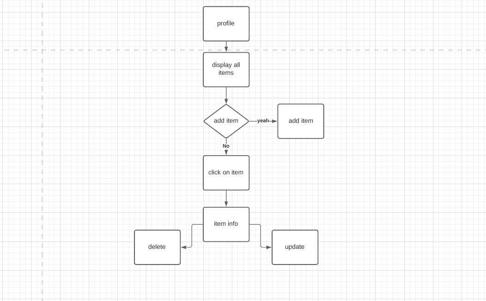
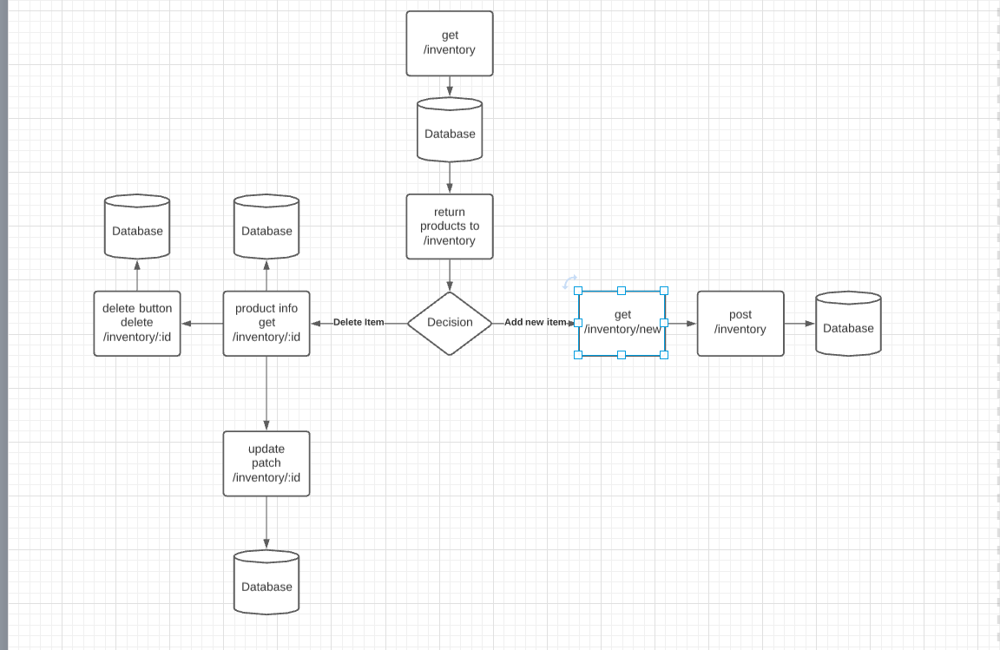
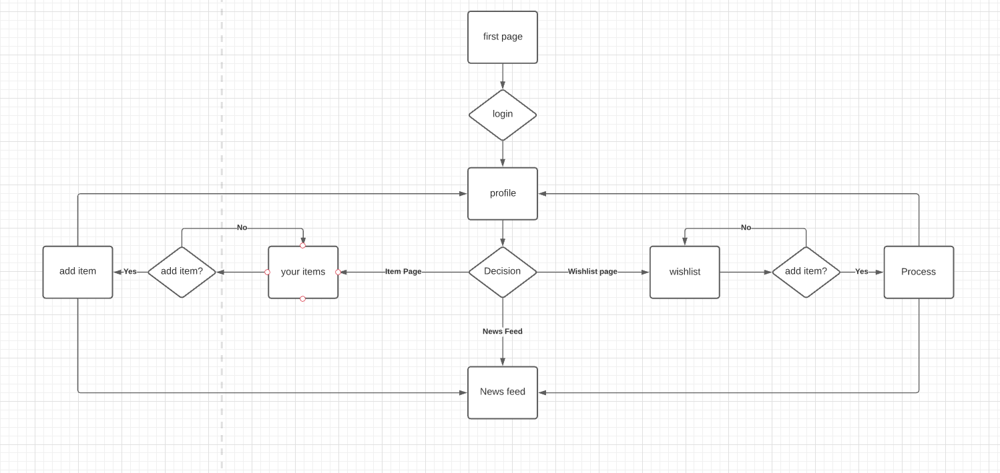

# The_Barter_exchange

Link to hosted site: 
[theBarterExchange](https://the-barter-exchange.herokuapp.com/)

### Idea
Using Ruby and Sinatra to create an online market place where instead of buying and selling items users can trade items. Users will be able to: log in/out, upload items, delete items, update items and read items. 
> I would like to add extra functionality such as viewing other users profiles, viewing in a newsfeed all items up for trade and hopefully be able to add the trading functionality transfering items between users.

### Planning
To start the planning process I used Lucidchart to create some flow diagrams as shown below.

### Technical Requirements
- [x] Have ideally 2 resources(tables) (more tables if they make sense or less tables) – one representing someone using your application, and one that represents the main functional idea for your app

- [x] Include sign up/log in functionality(if they make sense), with encrypted passwords & an authorization flow

- [x] Have complete RESTful routes for at least one of your resource with GET, POST, PATCH, and DELETE for read, create, update and delete

- [x] Include wireframes that you designed during the planning process

- [x] Have semantically clean HTML and CSS

- [x] Be deployed online and accessible to the public

### Technologies Used:
* Ruby 
* HTML
* CSS
* Sinatra (Web-Framework)
* BCrypt (Password Encryption)
* Postgresql

### Unsolved Problems

* As i spent much of my time on the technical details i was unable to create a clean design for the application.
* there is not yet user confirmation when making trades.
* I was hoping to add JavaScript to the project to create a better user experiance.